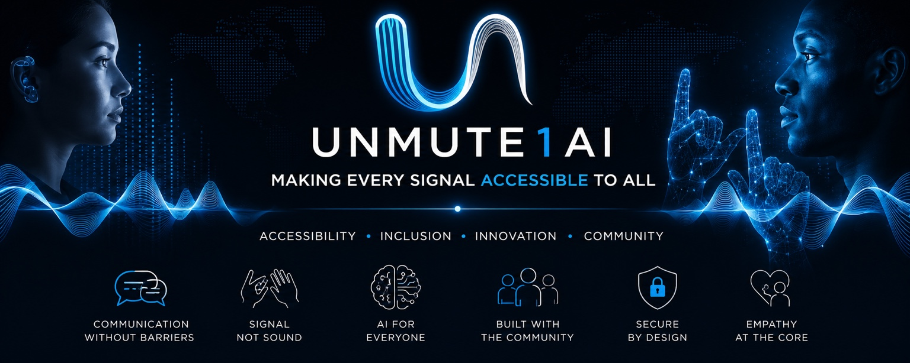

# Unmute1AI OS — Desktop Foundation 0.1



An installable Ubuntu 24.04 LTS desktop customization with a native GTK4 Start app.
**This archive is not a bootable ISO and does not install Ubuntu onto a blank disk.**

## Install on Ubuntu Desktop 24.04

Extract this archive. Open a Terminal in the extracted `unmute1ai-os` folder:

```bash
bash install.sh
```

Run as your normal desktop account; the installer asks for your password for system changes. Internet is needed to install Ubuntu dependencies. Once installed, the Start app, wallpaper, theme and system shortcuts work offline. The website button opens an external site only when clicked. Reboot manually when ready.

If this computer currently runs Alpine, Garuda or Windows, install Ubuntu Desktop first. This installer exits on other distributions. It does not partition disks or replace a bootloader.

## Included

- Your wide blue banner as the Plymouth boot watermark and Start app banner.
- Your larger blue artwork as an uncropped, aspect-preserving wallpaper.
- Your metal badge as the Start launcher icon, including an original-size copy.
- Native dark Start app: graphite panels, rounded buttons, quiet blue accents, keyboard focus indicators and standard GTK accessibility semantics.
- Centered, compact bottom dock when Ubuntu Dock is available.
- Shortcuts for accessibility, display, sound, Wi-Fi, Ethernet, files and terminal.
- A first-login welcome screen and a button to restore prior personal settings.
- Ubuntu's two-step boot engine for password entry, update progress and shutdown messages.

The Apple-inspired design uses existing Ubuntu/GNOME components. It does not copy macOS assets or replace GNOME Shell. No global custom icon theme, custom login-screen shell, AI models, Sentinel enforcement, sign translation or voice engine is included. Boot progress and any security guarantees remain those of Ubuntu.

## Remove

From the same folder, in your regular desktop account:

```bash
bash uninstall.sh
```

This restores settings captured when the desktop was first applied and removes the package. A later independently selected boot theme is preserved. Other accounts that applied their own U1 settings should run `u1-start --restore` before removing the shared package. Restore intentionally returns the captured settings, including changes made manually after applying U1.

## Direct Debian package install

`dist/unmute1ai-os-desktop_0.1.0_all.deb` is the built package. If installed directly, open Unmute1AI Start and click **Make this my desktop**, then run `sudo u1-os-boot enable` for startup branding. Ubuntu normally uses `quiet splash`; the package does not edit boot arguments. The firmware/GRUB screen before Plymouth keeps its existing branding.

## Build / validation

```bash
bash build.sh
python3 -m unittest discover -s tests -v
```

See `VALIDATION.md` for exactly what was tested and `ISO-BUILD.md` for the remaining bootable-image workflow. Ubuntu's package manager and OS identity remain intact so distribution detection and updates continue to work.

## References

- [Plymouth engine](https://www.freedesktop.org/wiki/Software/Plymouth/)
- [Ubuntu live image customization](https://help.ubuntu.com/community/LiveCDCustomization)
- [Cubic terminal workflow](https://github.com/PJ-Singh-001/Cubic/wiki/Terminal-Page)

Source scripts may be used and modified by Unmute1AI. Supplied artwork remains the owner's material. Ubuntu/GNOME components retain their upstream licenses and are installed from Ubuntu; they are not bundled here.
